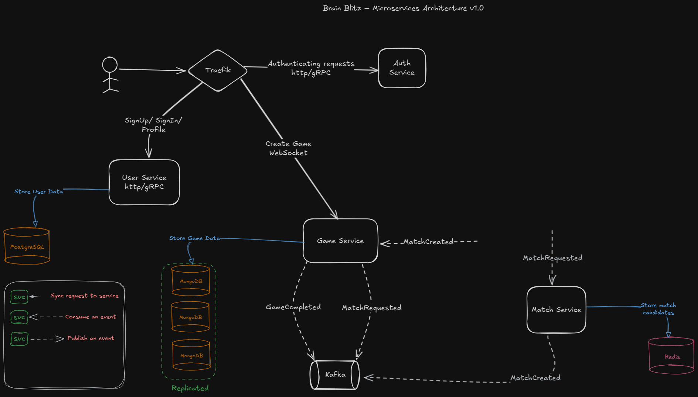

# 🧠 BrainBlitz

## 🧩 Main Components
This project follows a microservices architecture for a multiplayer quiz game called Brain Blitz.  

### 🛡️ 1. Traefik (API Gateway)
* Acts as the reverse proxy and entry point for all external HTTP requests.
* It routes all incoming requests to the appropriate microservice.
* Manages the Authentication validation by forwarding requests to `Auth Service`.
### 🔐 2. Auth Service
* Manages user authentication by providing HTTP and gRPC servers.
### 👤 3. User Service
* Handles user registration `(SignUp)`, login `(SignIn)`, and `profile` retrieval.
* Stores user credentials and metadata in a **PostgreSQL** database.
### 🎮 4. Game Service
* Orchestrates the game flow logic.
* Persists game sessions, and scores in **MongoDB**.
* Publishes: `MatchRequested`, and `GameCompleted` events and consumes `MatchCreated` event.
### 🤝 5. Match Service
* Subscribes to `MatchRequested` events, and publishes `MatchCreated` via **Kafka**.
* Handles matchmaking logic to pair players for a game.
* Stores matchmaking candidates in **Redis**.
### 📨 6. Kafka (Event Broker)
* Manages Asynchronous communication between services via event streams.
* Topics: `match.requested`, `match.created`, `game.completed`
### 🛢️ 7. Databases
* **PostgreSQL**: Stores user data and credentials.
* **MongoDB**: Stores game sessions, results, questions, answers, and history.
* **Redis**: Temporary in-memory store for active match candidates.

Each service is independently deployable, follows the single responsibility principle, and communicates either synchronously via HTTP/gRPC or asynchronously using Kafka.

## 🚀 How to Run the Application

### step 1: Create shared network with docker:
```bash 
docker network create bb-network
```

### step 3: Run all services in the main directory:
```bash
docker-compose up -d
```

## System Architecture


## Replication Setup
For instructions on setting up MongoDB or PostgreSQL replication read: [MongoDB Replication Guide](docs/mongodb-replication.md), [PostgreSQL Replication Guide](docs/postgresql-replication.md)  
[PostgreSQL vs. MongoDB Replication](docs/PostgreSQL-vs-MongoDB-replication.md)

## ☸️ Kubernetes Init
For setting up kubernetes read: [Kubernetes Setup](docs/kubernetes-init.md)

## 🤝 How to Contribute and Commit

### Protobuf
make sure to have correct package name inside your .proto file.
#### ```option go_package = "contract/[YOUR_SERVICE]/golang";```
#### Example:
option go_package = "contract/match/golang";
### How to generate .go files from .proto file
```bash
protoc --go_out=. --go-grpc_out=. contract/[YOUR_SERVICE]/proto/[YOUR_PROTO_FILE.proto]
```
#### Example:
```bash
protoc --go_out=. --go-grpc_out=. contract/match/proto/match.proto
```

Happy coding! 🚀