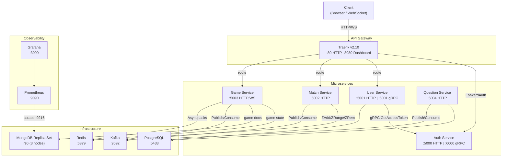
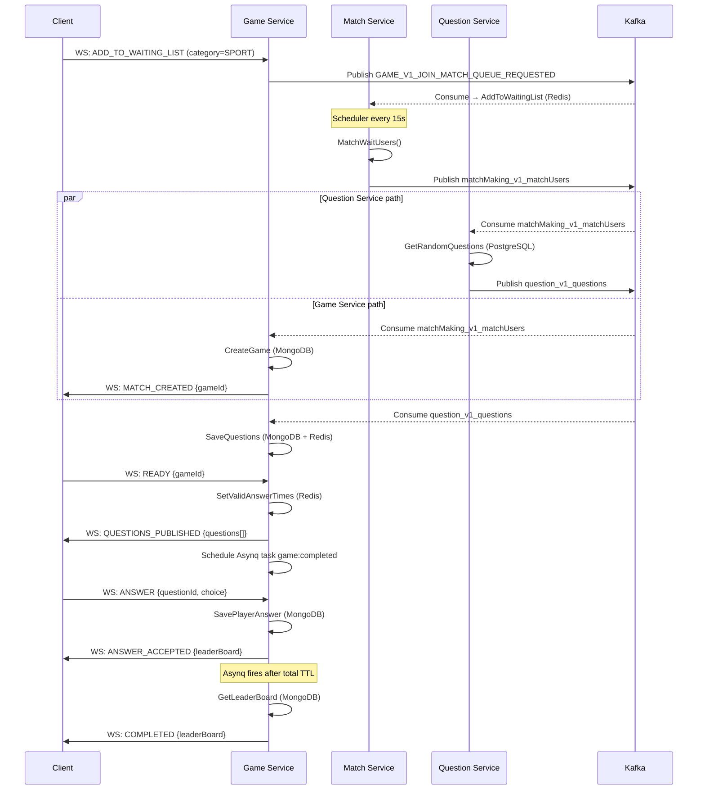
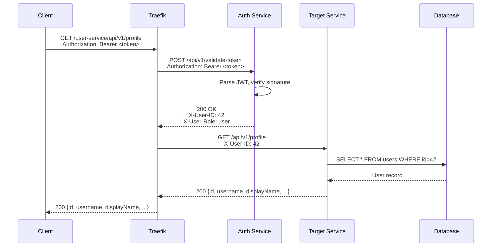
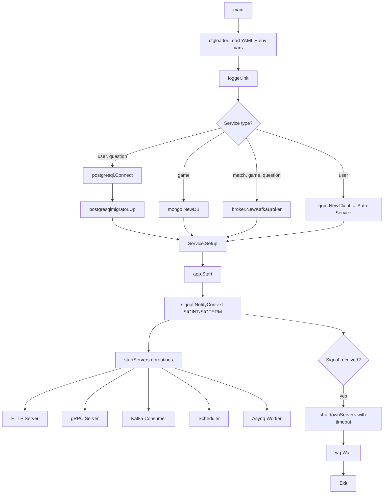
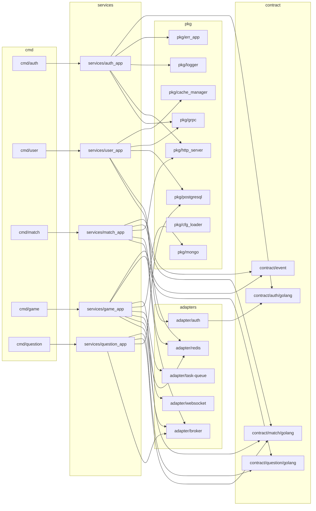
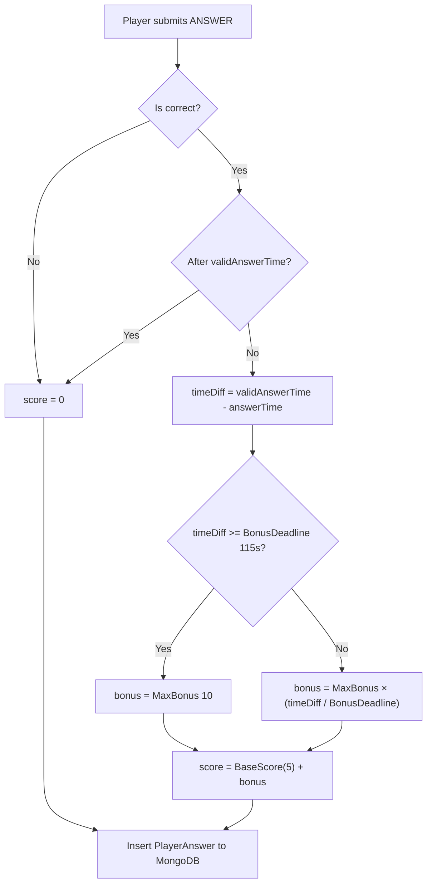
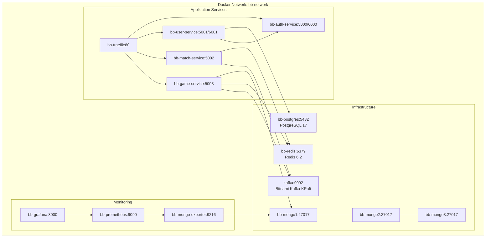

# Architecture Diagrams

## System Architecture Overview

## Kafka Event Flow

## Request Lifecycle — Protected Route

## Service Startup Flow

## Game State Machine

```mermaid
stateDiagram-v2
    [*] --> UNKNOWN : Player connects via WS
    UNKNOWN --> INITIALIZED : ADD_TO_WAITING_LIST command
    INITIALIZED --> PENDING : Match Service pairs players
    PENDING --> PENDING : READY received (not all ready)
    PENDING --> STARTED : All players READY
    STARTED --> FINISHED : Asynq game:completed fires
    FINISHED --> [*]

    note right of UNKNOWN : Server sends categories list
    note right of INITIALIZED : User added to Redis waiting list
    note right of PENDING : Game created in MongoDB;\nQuestions cached in Redis
    note right of STARTED : Questions sent to all players;\nAnswer window open
    note right of FINISHED : Final leaderboard sent;\nWS connections closed
```

## Package Dependency Graph

## Scoring Algorithm

## Deployment Architecture (Docker Compose)

